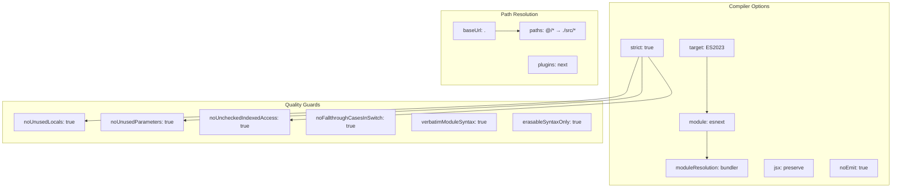
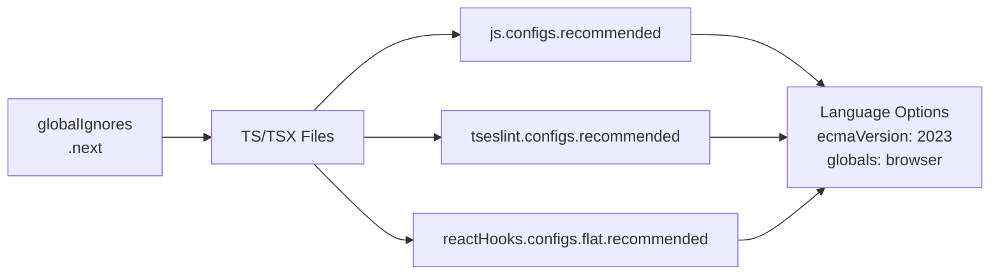
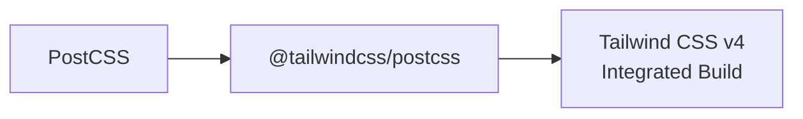
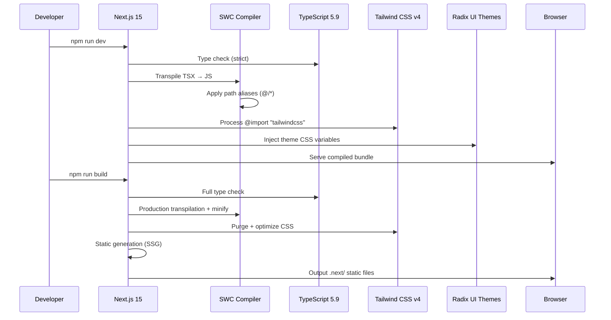
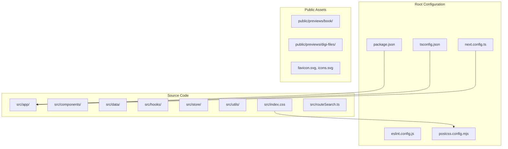

# Project Architecture & Configuration Report

## Executive Summary

The Image Asset Manager is a **Next.js 15.3.3** application built with **React 19**, **TypeScript 5.9.3**, and **Tailwind CSS v4**. It uses the Next.js App Router pattern and follows a client-side heavy architecture — all interactive components are marked with `"use client"` while the root layout remains server-rendered. The project manages a book archive for Winston van der Bok, a Kalihna indigenous artist from Suriname.

---

## Technology Stack Hierarchy

```mermaid
graph TD
    subgraph "Runtime & Framework"
        A[Next.js 15.3.3<br/>App Router]
        B[React 19.2.4]
        C[React DOM 19.2.4]
    end

    subgraph "State & UI"
        D[Jotai 2.19.0<br/>Atomic State]
        E[@radix-ui/themes 3.3.0<br/>Component Library]
        F[@radix-ui/react-focus-scope<br/>Focus Management]
    end

    subgraph "Styling"
        G[Tailwind CSS 4.2.2]
        H[@tailwindcss/postcss<br/>PostCSS Plugin]
        I[Custom CSS<br/>1435 lines]
    end

    subgraph "Tooling"
        J[TypeScript 5.9.3<br/>Strict Mode]
        K[ESLint 9.39.4<br/>Flat Config]
        L[typescript-eslint 8.57.0]
        M[eslint-plugin-react-hooks 7.0.1]
    end

    subgraph "Build & Deploy"
        N[PostCSS]
        O[Vercel SDK 1.19.40]
    end

    A --> B
    A --> J
    B --> C
    B --> D
    B --> E
    E --> F
    G --> H
    H --> N
    J --> L
    K --> L
    K --> M
    A --> O
```

---

## Configuration Files Deep Dive

### package.json

| Field | Value | Purpose |
|-------|-------|---------|
| `name` | `image-asset-manager` | Project identifier |
| `type` | `module` | ESM-first module system |
| `private` | `true` | Prevents accidental npm publish |
| `scripts.dev` | `next dev` | Development server |
| `scripts.build` | `next build` | Production build with type-checking |
| `scripts.start` | `next start` | Production server |
| `scripts.lint` | `next lint` | ESLint execution |

**Key Dependencies:**
- `@radix-ui/themes`: Provides themed UI primitives (Button, Dialog, Select, TextField, etc.)
- `@vercel/sdk`: Potential deployment/integration hooks
- `jotai`: Atomic state management with `atomWithStorage` for persistence
- `next`: Meta-framework with App Router, static optimization

**Key DevDependencies:**
- `@tailwindcss/postcss`: Tailwind v4 PostCSS integration
- `typescript-eslint`: Type-aware linting
- `eslint-plugin-react-hooks`: Rules of Hooks enforcement

### tsconfig.json



The TypeScript configuration is **aggressively strict**, enabling:
- `verbatimModuleSyntax`: Enforces `type` imports for type-only usage
- `erasableSyntaxOnly`: Ensures all TypeScript syntax is erasable (no enum, namespace, etc.)
- `noUncheckedIndexedAccess`: Forces null-checking on indexed access
- `isolatedModules`: Required for Babel/swc transpilation

### next.config.ts

```typescript
const nextConfig: NextConfig = {
  async redirects() {
    return [
      { source: "/book", destination: "/", permanent: true },
    ];
  },
};
```

Minimal configuration — only a single redirect. No custom webpack, no image optimization config, no experimental flags. The app relies on Next.js defaults.

### eslint.config.js



ESLint 9 flat config format with three config layers applied to all `**/*.{ts,tsx}` files.

### postcss.config.mjs



Tailwind CSS v4 uses a PostCSS plugin rather than the traditional standalone CLI approach.

---

## Build Pipeline Flow



---

## File Structure Overview



---

## Key Architectural Decisions

| Decision | Rationale |
|----------|-----------|
| **App Router + Client Components** | Layout/SEO benefits of App Router with interactive client-side UI |
| **Jotai over Redux/Context** | Simpler atomic state, built-in persistence via `atomWithStorage` |
| **URL-as-state** | Shareable links, back-button support, no server session needed |
| **Preview assets in `public/`** | Static serving, no image optimization pipeline needed |
| **Tailwind v4 + Custom CSS** | Utility classes for rapid development, custom CSS for complex design system |
| **Strict TypeScript** | Catches errors at compile time, enforces clean imports |
| **Dutch UI language** | Target audience is Dutch-speaking (book production team) |

---

## Dependency Graph

```mermaid
graph TD
    subgraph "External Dependencies"
        E1[next]
        E2[react]
        E3[jotai]
        E4[@radix-ui/themes]
        E5[@radix-ui/react-focus-scope]
        E6[@vercel/sdk]
    end

    subgraph "Internal Modules"
        I1[src/app/]
        I2[src/components/]
        I3[src/data/]
        I4[src/hooks/]
        I5[src/store/]
        I6[src/utils/]
    end

    I1 --> E1
    I1 --> E2
    I1 --> E3
    I1 --> E4
    I2 --> E2
    I2 --> E3
    I2 --> E4
    I2 --> E5
    I2 --> I3
    I2 --> I4
    I2 --> I5
    I2 --> I6
    I4 --> E3
    I4 --> I5
    I4 --> I6
    I5 --> E3
    I5 --> I3
    I5 --> I6
    I6 --> I3
```

The project maintains a **clean dependency structure** with no circular dependencies between internal modules. Data flows from `data/` → `store/` → `hooks/` → `components/`.
