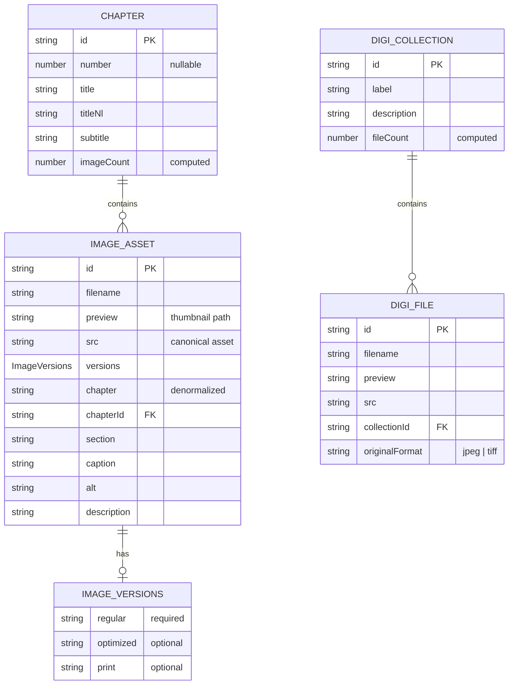
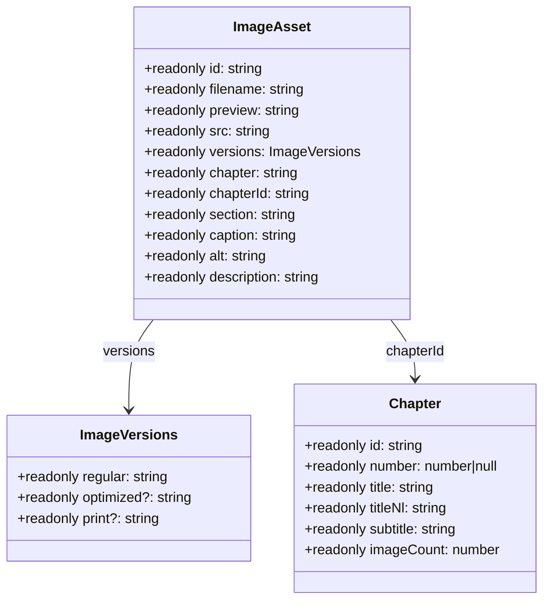
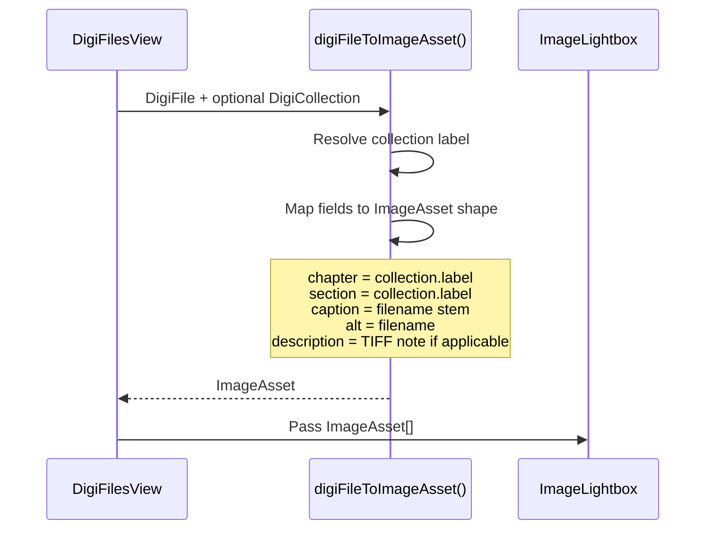
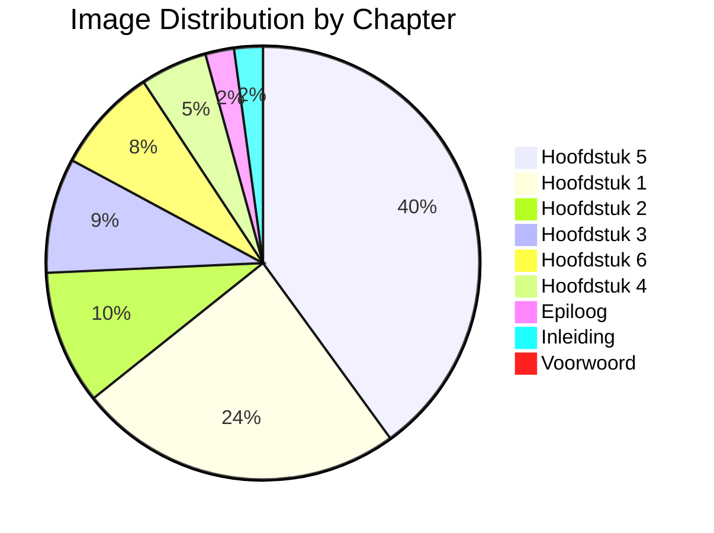
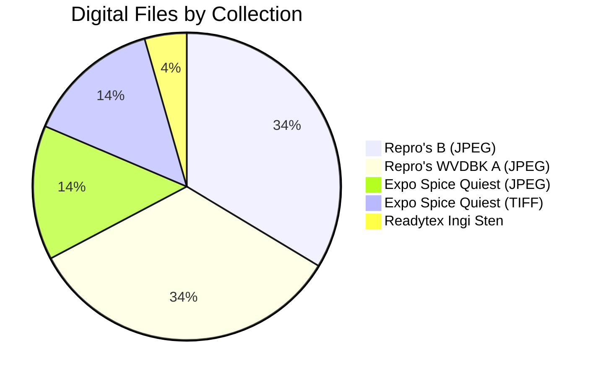
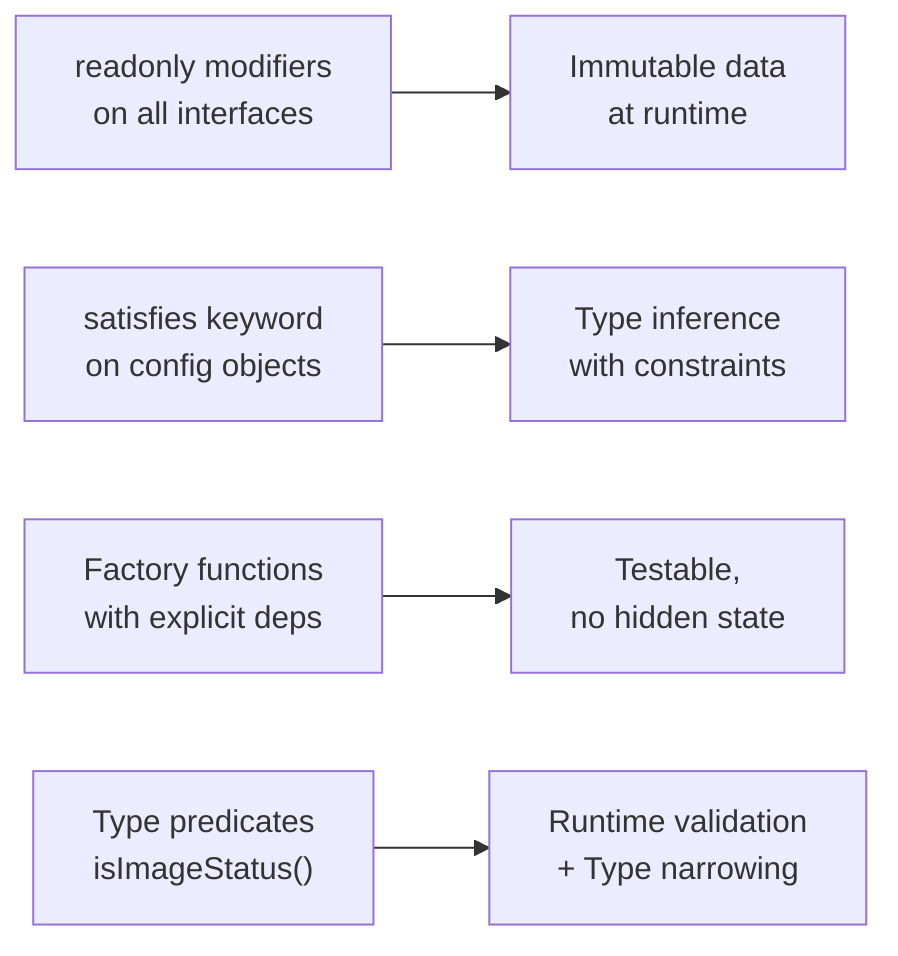

# Data Model & Type System Report

## Executive Summary

The Image Asset Manager defines a rich, immutable type system centered around two primary asset domains: **book images** (`ImageAsset` + `Chapter`) and **digital file collections** (`DigiFile` + `DigiCollection`). All data is statically typed with `readonly` modifiers, computed at module initialization, and never mutated at runtime. A dedicated translation layer (`archiveTextNl.ts`) handles English-to-Dutch localization at data construction time.

---

## Entity Relationship Diagram



---

## ImageAsset Type Deep Dive



### Design Patterns in ImageAsset

1. **Versioned Assets**: The `versions` field supports three tiers:
   - `regular`: Always present, browser-ready preview
   - `optimized`: Compressed/resized for screen viewing
   - `print`: High-resolution, color-corrected for print production

2. **Denormalized Chapter Name**: `chapter` is stored as a string (looked up from `Chapter.title` at construction) for display convenience, while `chapterId` maintains the foreign key relationship.

3. **Hierarchical Organization**: `section` provides sub-chapter grouping within a chapter.

---

## Data Construction Pipeline

```mermaid
flowchart TB
    subgraph "Chapter Definition"
        A[rawChapters<br/>Omit<Chapter, "imageCount">[]]
    end

    subgraph "Image Factory"
        B[img() factory function]
        B1["preview = /previews/book/{filename}.jpg"]
        B2["id = filename without extension"]
        B3["chapter = lookup from rawChapters"]
        B4["section/caption/alt/description = translateArchiveTextToDutch()"]
    end

    subgraph "Computed Registry"
        C[images<br/>readonly ImageAsset[]]
        D[chapters<br/>readonly Chapter[]]
        D1["imageCount = filter(images).length"]
    end

    subgraph "Access Functions"
        E[getChapterImages(chapterId)]
        F[getChapter(chapterId)]
    end

    A --> B
    B --> B1
    B --> B2
    B --> B3
    B --> B4
    B --> C
    C --> D1
    A --> D
    D1 --> D
    D --> E
    C --> E
    D --> F
```

### Factory Function: `img()`

```typescript
function img(
  chapterList: readonly Omit<Chapter, "imageCount">[],
  filename: string,
  chapterId: string,
  section: string,
  caption: string = "",
  alt: string = "",
  description: string = "",
): ImageAsset
```

The factory function:
1. Converts any filename extension to `.jpg` for the preview path
2. Derives the ID from the filename stem
3. Looks up the chapter title from the provided chapter list
4. **Translates all text fields to Dutch** via `translateArchiveTextToDutch()`

This design intentionally avoids hidden closure dependencies by requiring `chapterList` as an explicit parameter.

---

## Digital Files Data Model

```mermaid
flowchart LR
    subgraph "DigiFile Factory"
        A[makeFile(filename, collectionId, originalFormat)]
        A1["preview = /previews/digi-files/{collectionId}/{filename}.jpg"]
        A2["id = {collectionId}__{filename}"]
    end

    subgraph "Collections"
        B[expo-spice-quiest<br/>16 files]
        C[repros-b<br/>38 files]
        D[readytex-ingi-sten<br/>5 files<br/>tiff origin]
        E[wvdbk-jpeg-a<br/>38 files]
        F[tiff-expo-spice-quiest<br/>16 files<br/>tiff origin]
    end

    subgraph "Unified Registry"
        G[digiFiles<br/>readonly DigiFile[]]
        H[digiCollections<br/>readonly DigiCollection[]]
    end

    B --> G
    C --> G
    D --> G
    E --> G
    F --> G
    G --> H
```

### DigiFile → ImageAsset Conversion



The `digiFileToImageAsset()` adapter function enables the unified `ImageLightbox` component to display both book images and digital files without modification.

---

## Translation System Architecture

```mermaid
flowchart TB
    subgraph "Input"
        A[English Text<br/>from book layout/archive]
    end

    subgraph "Translation Engine"
        B[translateArchiveTextToDutch(value)]
        B1["Falsy check → return as-is"]
        B2["Exact match lookup<br/>exactTranslations[ value ]"]
        B3["Regex replacement chain<br/>replacementPairs.reduce()"]
    end

    subgraph "Output"
        C[Dutch Text<br/>in UI and data model]
    end

    A --> B
    B --> B1
    B1 -->|value truthy| B2
    B2 -->|no exact match| B3
    B2 -->|exact found| C
    B3 --> C
```

### Translation Strategy

| Layer | Implementation | Count |
|-------|---------------|-------|
| **Exact Translations** | `Record<string, string>` hash map | 38 entries |
| **Pattern Replacements** | Ordered `[RegExp, string][]` array | 76 regex pairs |

**Critical Rule**: Longer/more-specific patterns MUST precede substring patterns to prevent double-translation. The `reduce()` applies pairs in declared order.

Example vulnerable pair:
```typescript
[/The Spirit of the Sunflower/g, "De geest van de zonnebloem"]
[/Spirit of the Sunflower/g, "De geest van de zonnebloem"]
[/Sunflower/g, "Zonnebloem"]
```
The longer phrase is matched first, preventing "De geest van de Zonnebloem".

---

## Chapter Distribution



| Chapter | ID | Images | % of Total |
|---------|-----|--------|-----------|
| Voorwoord | `voorwoord` | 1 | 0.7% |
| Inleiding | `inleiding` | 3 | 2.1% |
| De Kalihna-cultuur | `hoofdstuk-1` | 34 | 23.8% |
| Kinderjaren tussen werelden | `hoofdstuk-2` | 14 | 9.8% |
| Terug in Suriname | `hoofdstuk-3` | 12 | 8.4% |
| Waka Tjopu | `hoofdstuk-4` | 7 | 4.9% |
| Zelfstandig ondernemer... | `hoofdstuk-5` | 56 | 39.2% |
| Op leven en dood | `hoofdstuk-6` | 11 | 7.7% |
| Epiloog | `epiloog` | 3 | 2.1% |
| **Total** | — | **141** | **100%** |

---

## Digital Collections Overview



| Collection | Files | TIFF Origin |
|-----------|-------|-------------|
| expo-spice-quiest | 16 | No |
| repros-b | 38 | No |
| readytex-ingi-sten | 5 | **Yes** |
| wvdbk-jpeg-a | 38 | No |
| tiff-expo-spice-quiest | 16 | **Yes** |
| **Total** | **113** | 21 |

---

## Type Safety Patterns



### `satisfies` Usage

```typescript
export const statusConfig = {
  approved: { label: "Goedgekeurd", color: "green" as const },
  // ...
} as const satisfies Record<ImageStatus, { label: string; color: string }>;
```

The `satisfies` operator ensures the object shape matches the expected type while preserving literal type inference (e.g., `"green"` not `string`).

### `Readonly<T>` and `readonly` Arrays

All exported data arrays are marked `readonly`:
```typescript
export const images: readonly ImageAsset[] = [...];
export const chapters: readonly Chapter[] = [...];
export const digiFiles: readonly DigiFile[] = [...];
```

This enforces immutability at the TypeScript level, preventing accidental mutations.
