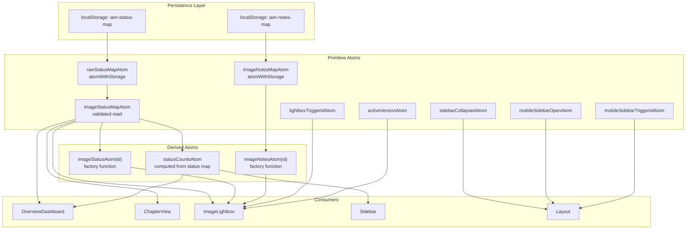
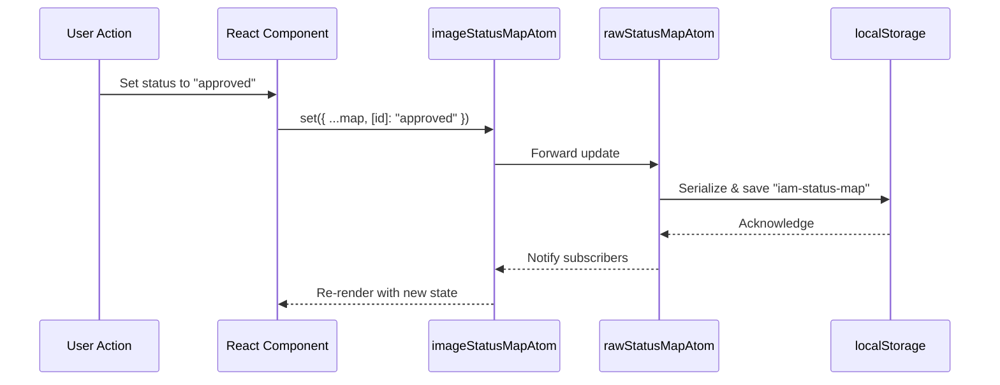
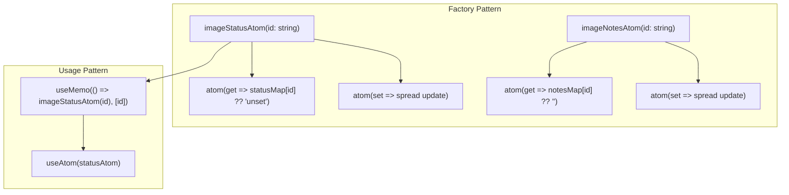
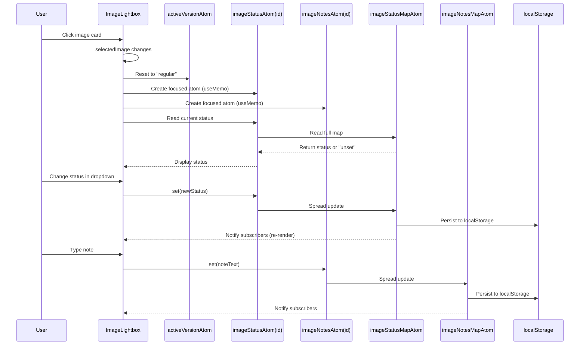
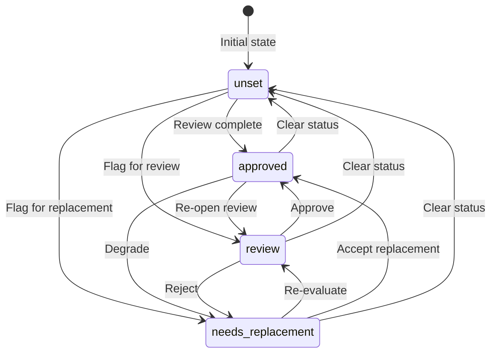
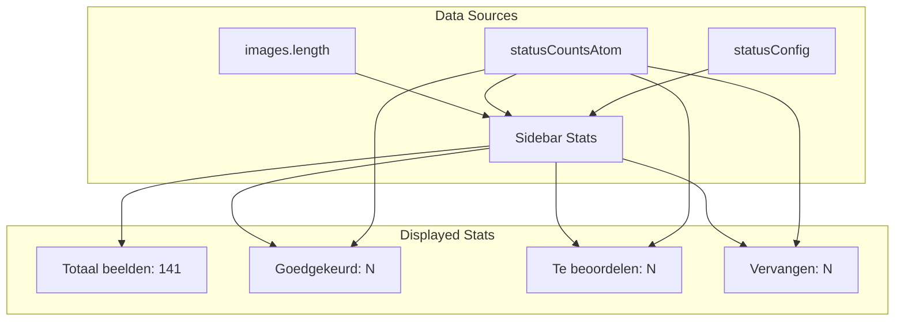
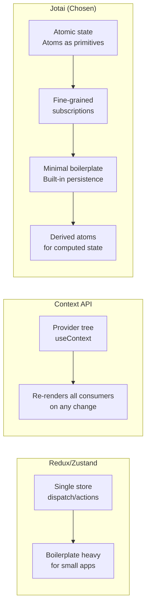

# State Management Report

## Executive Summary

State management in the Image Asset Manager is built entirely on **Jotai**, an atomic state library for React. The architecture follows a two-tier pattern: **primitive atoms** for raw state persistence (backed by `localStorage`) and **derived atoms** for computed values and focused per-entity access. No Redux, Context API, or Zustand is used. All state is client-side; there is no server state or API integration.

---

## State Architecture Overview



---

## Primitive Atoms

### Persistence Atoms



#### `imageStatusMapAtom`

| Aspect | Implementation |
|--------|---------------|
| Storage Key | `iam-status-map` |
| Default Value | `{}` |
| Validation | `isValidStatusMap()` checks every value against `isImageStatus()` |
| Corruption Handling | Returns `{}` if localStorage contains invalid data |
| Write Pattern | Spread update: `{ ...current, [id]: value }` |

```typescript
export const imageStatusMapAtom = atom<Record<string, ImageStatus>, [Record<string, ImageStatus>], void>(
  (get) => {
    const raw = get(rawStatusMapAtom);
    return isValidStatusMap(raw) ? raw : {};
  },
  (_get, set, next) => {
    set(rawStatusMapAtom, next);
  },
);
```

This is a **read-write derived atom** that wraps the raw storage atom with validation. The validation runs on every read, ensuring corrupted localStorage entries never propagate to the UI.

#### `imageNotesMapAtom`

| Aspect | Implementation |
|--------|---------------|
| Storage Key | `iam-notes-map` |
| Default Value | `{}` |
| Validation | None (strings are forgiving) |
| Write Pattern | Spread update |

### UI State Atoms

| Atom | Purpose | Persisted? |
|------|---------|-----------|
| `lightboxTriggerIdAtom` | Restore focus after lightbox closes | No |
| `sidebarCollapsedAtom` | Desktop sidebar collapsed state | No |
| `mobileSidebarOpenAtom` | Mobile drawer open state | No |
| `mobileSidebarTriggerIdAtom` | Restore focus after mobile sidebar closes | No |
| `activeVersionAtom` | Current version tab in lightbox | No |

---

## Derived Atoms

### `statusCountsAtom`

```mermaid
flowchart LR
    A[images<br/>readonly ImageAsset[]] --> C[computeStatusCounts]
    B[imageStatusMapAtom] --> C
    C --> D[statusCountsAtom]
    D --> E[Record<ImageStatus, number>]

    style E fill:#e0f2fe
```

Computes per-status counters across the **entire image registry**. The derived atom only recomputes when `imageStatusMapAtom` changes, thanks to Jotai's dependency tracking.

```typescript
export const statusCountsAtom = atom((get) => {
  const statusMap = get(imageStatusMapAtom);
  return computeStatusCounts(images, statusMap);
});
```

### Factory Functions: `imageStatusAtom()` and `imageNotesAtom()`



**Critical Design Decision**: These are **plain factory functions**, NOT Jotai's `atomFamily`. The caller MUST memoize the returned atom with `useMemo`:

```typescript
const statusAtom = useMemo(() => imageStatusAtom(selectedImage?.id ?? ""), [selectedImage?.id]);
const [currentStatus, setCurrentStatus] = useAtom(statusAtom);
```

Without `useMemo`, a new atom instance would be created on every render, losing state and causing unnecessary re-renders.

---

## State Flow in ImageLightbox



---

## Status Lifecycle



---

## Sidebar Stats Integration



The sidebar displays four statistics derived from two sources:
1. **Static**: Total image count from `images.length`
2. **Dynamic**: Per-status counts from `statusCountsAtom` (reactive to status changes)

---

## State Consistency Guarantees

| Guarantee | Mechanism |
|-----------|-----------|
| **No stale data** | Jotai's dependency graph ensures derived atoms recompute when dependencies change |
| **No corruption** | `isValidStatusMap()` validates localStorage on every read |
| **No lost updates** | `atomWithStorage` handles serialization/deserialization |
| **Focus restoration** | `lightboxTriggerIdAtom` + `mobileSidebarTriggerIdAtom` capture trigger element IDs |
| **URL sync** | `useSurfaceSearchState` keeps React state and URL params in sync |

---

## Comparison: Why Jotai?



Jotai was chosen because:
1. **Minimal boilerplate** — atoms are simple declarations
2. **Fine-grained reactivity** — only components subscribing to changed atoms re-render
3. **Built-in persistence** — `atomWithStorage` handles localStorage with one line
4. **Derived state** — computed values are first-class citizens
5. **TypeScript native** — excellent type inference throughout
