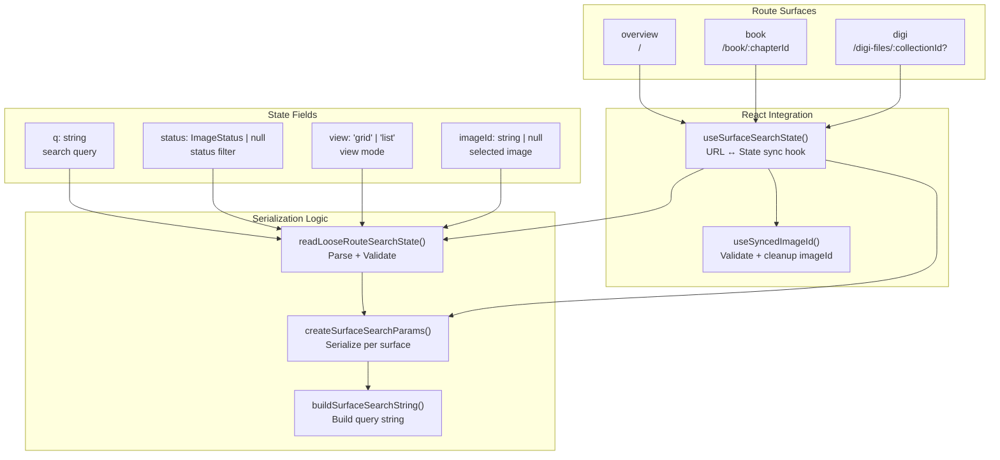
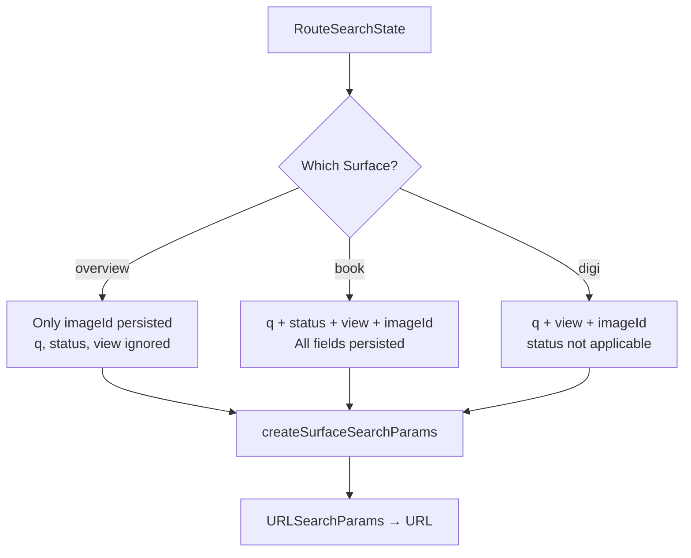
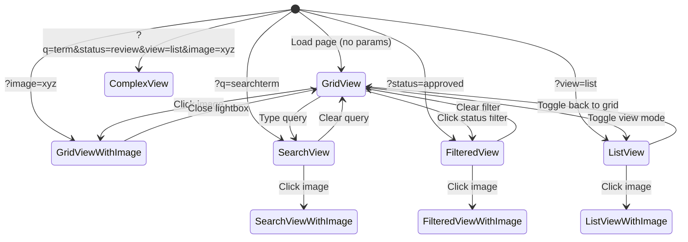
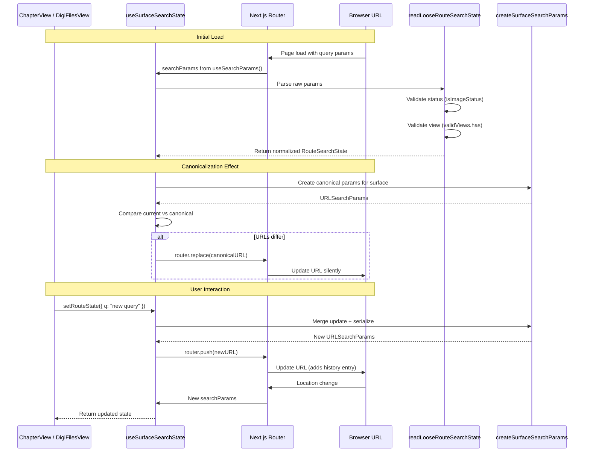
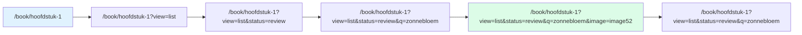
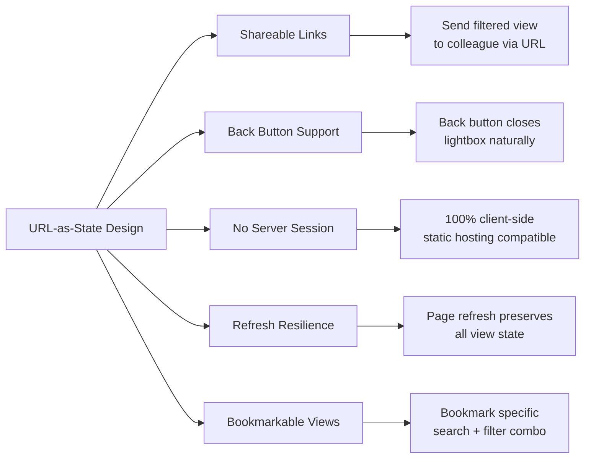
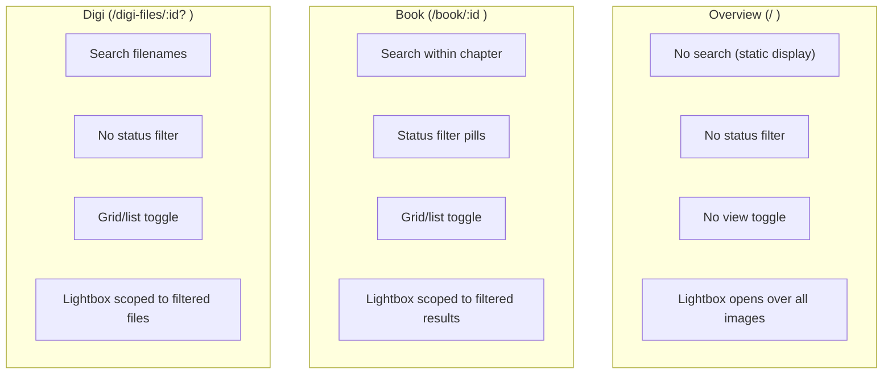

# Routing & URL State Management Report

## Executive Summary

The Image Asset Manager implements a **sophisticated URL-as-state system** that persists application state in the browser's URL search parameters. This enables deep-linking to any view configuration (search queries, filters, selected images, view modes) and provides full back-button support. The system is surface-aware, meaning different pages persist different subsets of state.

---

## URL State Architecture



---

## Surface-Aware State Serialization



### Serialization Rules by Surface

| State Field | `overview` | `book` | `digi` |
|------------|------------|--------|--------|
| `q` (search) | ❌ Not persisted | ✅ Persisted if non-empty | ✅ Persisted if non-empty |
| `status` | ❌ Not applicable | ✅ Persisted if set | ❌ Not applicable |
| `view` | ❌ Default (grid) | ✅ Persisted if not grid | ✅ Persisted if not grid |
| `imageId` | ✅ Always persisted | ✅ Always persisted | ✅ Always persisted |

```typescript
export function createSurfaceSearchParams(surface: RouteSurface, state: RouteSearchState): URLSearchParams {
  const nextSearchParams = new URLSearchParams();

  if (surface !== "overview" && state.q) {
    nextSearchParams.set("q", state.q);
  }

  if (surface === "book" && state.status) {
    nextSearchParams.set("status", state.status);
  }

  if (surface !== "overview" && state.view !== "grid") {
    nextSearchParams.set("view", state.view);
  }

  if (state.imageId) {
    nextSearchParams.set("image", state.imageId);
  }

  return nextSearchParams;
}
```

---

## URL State Machine



---

## `useSurfaceSearchState` Hook Flow



### Key Behaviors

1. **Canonicalization**: On mount, the hook compares the current URL against the canonical form for the surface. If they differ (e.g., invalid params, unnecessary defaults), it silently replaces the URL via `router.replace()`.

2. **Push vs Replace**: `setRouteState()` accepts an `options.replace` flag. Search text changes use `replace` (don't pollute history), while image selection uses `push` (back button closes lightbox).

3. **Validation**: `readLooseRouteSearchState()` validates all incoming params:
   - `status`: Must be a valid `ImageStatus` via `isImageStatus()`
   - `view`: Must be `"grid"` or `"list"`
   - `imageId`: Trimmed, empty becomes `null`
   - `q`: Trimmed

---

## `useSyncedImageId` Validation Flow

```mermaid
flowchart TB
    A[URL contains ?image=xyz] --> B{Is xyz in current items?}
    B -->|Yes| C[selectedImageId = xyz]
    B -->|No| D[selectedImageId = null]
    D --> E[useEffect cleanup]
    E --> F[setRouteState({ imageId: null }, { replace: true })]
    F --> G[Remove stale ?image param from URL]

    style C fill:#dcfce7
    style D fill:#fee2e2
```

This hook solves a critical UX problem: when filters change and the selected image is no longer in the visible results, the lightbox should close automatically rather than showing an orphaned image.

```typescript
export function useSyncedImageId(
  items: readonly { readonly id: string }[],
  imageId: string | null,
  setRouteState: (updates: Partial<RouteSearchState>, opts?: SetRouteStateOptions) => void,
): string | null {
  const isValid = imageId ? items.some((i) => i.id === imageId) : false;
  const selectedImageId = isValid ? imageId : null;

  useEffect(() => {
    if (imageId && !selectedImageId) {
      setRouteState({ imageId: null }, { replace: true });
    }
  }, [imageId, selectedImageId, setRouteState]);

  return selectedImageId;
}
```

---

## URL State in Practice

### Example URL Evolution



| Action | URL Change | History |
|--------|-----------|---------|
| Navigate to chapter | `/book/hoofdstuk-1` | Push |
| Switch to list view | `?view=list` | Push |
| Filter by "review" | `&status=review` | Push |
| Search "zonnebloem" | `&q=zonnebloem` | Replace |
| Open image | `&image=image52` | Push |
| Close lightbox (back) | Remove `&image=image52` | Back button |

---

## Sidebar Navigation with State Preservation

```mermaid
sequenceDiagram
    participant User as User
    participant Sidebar as Sidebar
    participant Link as Next.js Link
    participant URL as URL

    User->>Sidebar: Click chapter link
    Sidebar->>Sidebar: readLooseRouteSearchState(currentParams)
    Sidebar->>Sidebar: buildSurfaceSearchString("book", { ...state, imageId: null })
    Note over Sidebar: Preserves q, status, view<br/>Clears imageId for new page
    Sidebar->>Link: href="/book/chapter-id?q=...&status=..."
    Link->>URL: Navigate with preserved filters
```

The sidebar preserves the user's current search/filter state when navigating between chapters or collections, but intentionally clears `imageId` since the selected image is page-specific.

---

## Benefits of URL-as-State



---

## Route Surface Comparison


