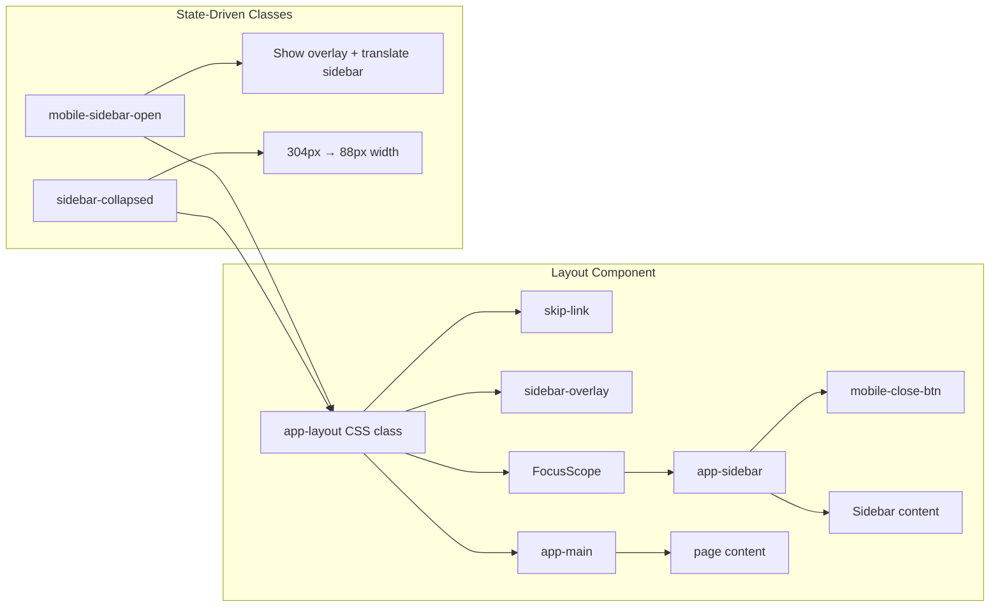
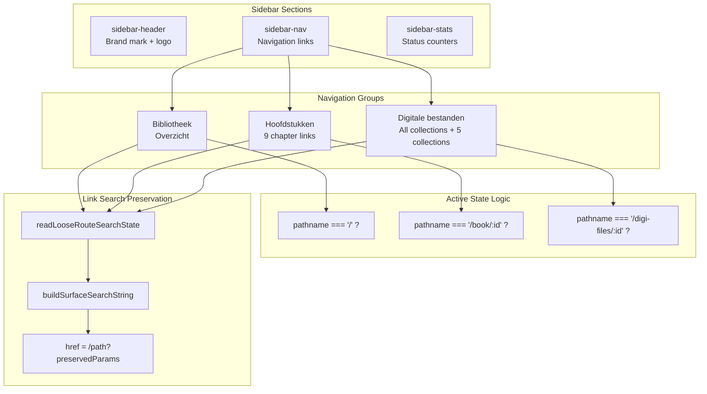
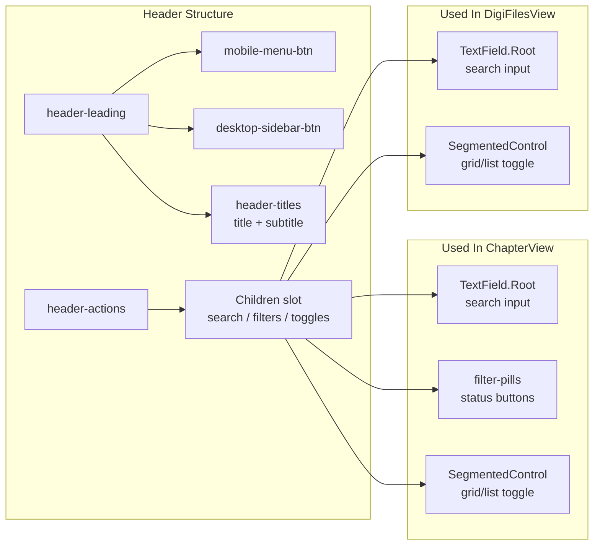
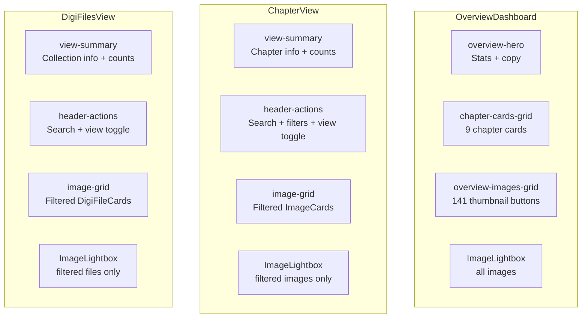
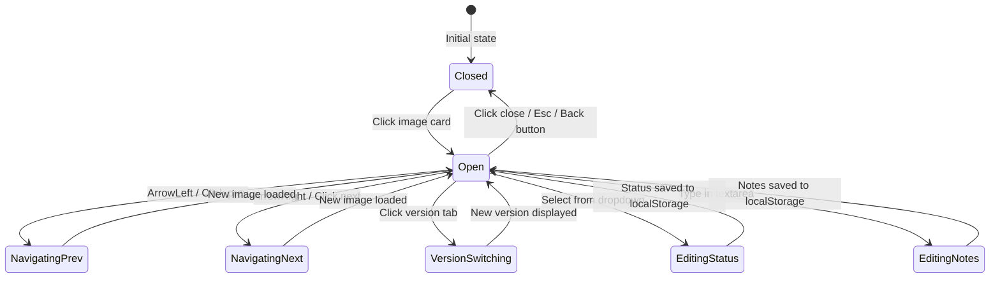
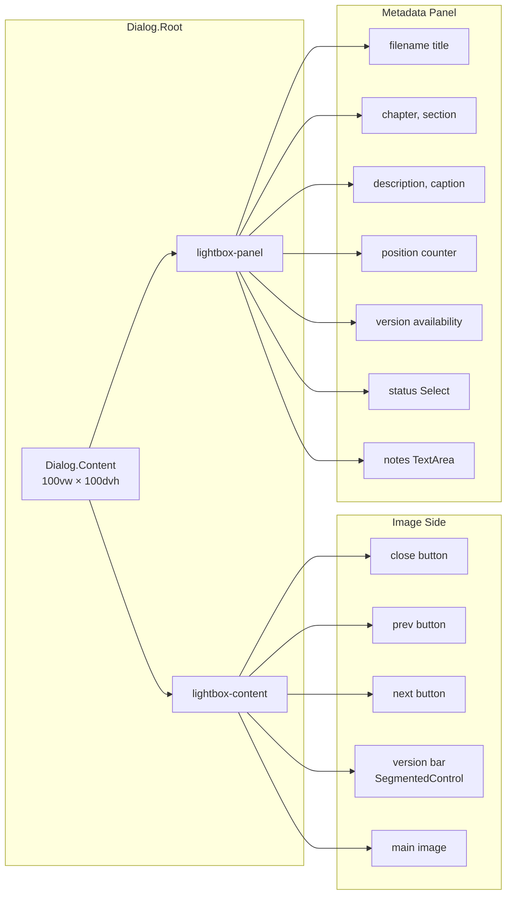
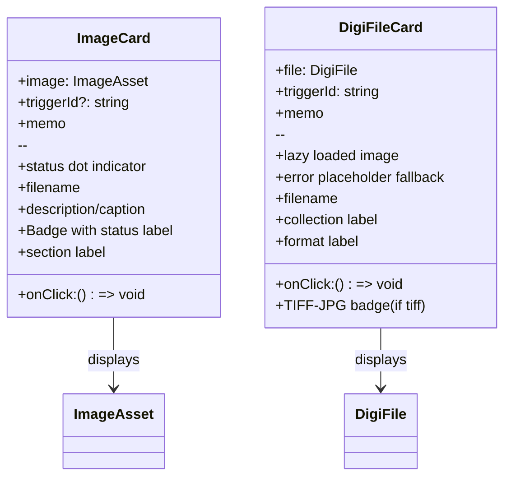
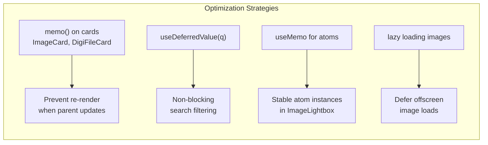
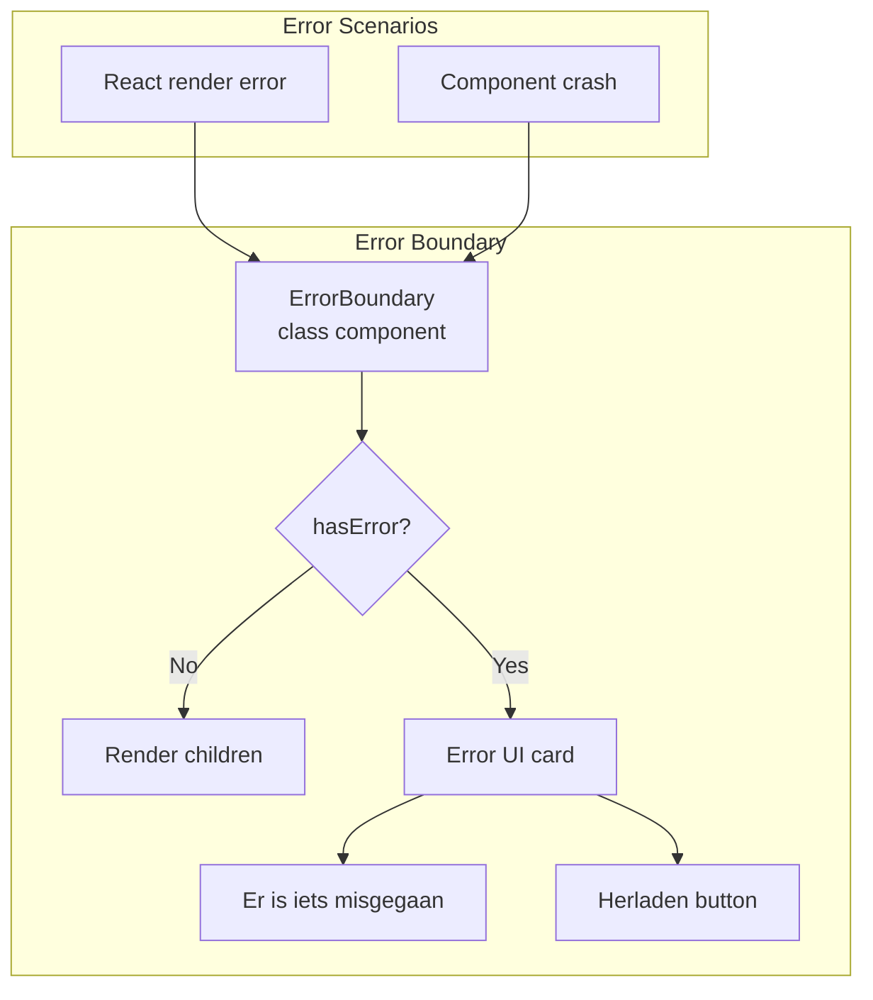

# Component Architecture Report

## Executive Summary

The Image Asset Manager follows a **layered component architecture** built on Next.js App Router patterns. The application shell (`Layout`, `Sidebar`, `Header`) provides persistent navigation and chrome, while view components (`OverviewDashboard`, `ChapterView`, `DigiFilesView`) render page-specific content. A shared `ImageLightbox` component serves as a universal overlay for inspecting assets across all views. All interactive components are client components; the root layout is server-rendered.

---

## Component Hierarchy Tree

```mermaid
graph TB
    subgraph "Root"
        R1[RootLayout<br/>Server Component]
    end

    subgraph "Providers"
        P1[JotaiProvider]
        P2[Theme<br/>Radix UI]
    end

    subgraph "Shell"
        S1[Layout<br/>"use client"]
        S2[Sidebar<br/>"use client"]
        S3[Header<br/>"use client"]
    end

    subgraph "Pages"
        PG1[HomePage<br/>/]
        PG2[ChapterPage<br/>/book/:id]
        PG3[DigiFilesPage<br/>/digi-files/:id?]
        PG4[NotFoundPage<br/>404]
    end

    subgraph "Views"
        V1[OverviewDashboard<br/>"use client"]
        V2[ChapterView<br/>"use client"]
        V3[DigiFilesView<br/>"use client"]
    end

    subgraph "Shared Components"
        C1[ImageLightbox<br/>"use client"]
        C2[ImageCard<br/>memo]
        C3[DigiFileCard<br/>memo]
        C4[ConditionalTooltip]
        C5[Icons<br/>pure functions]
        C6[ErrorBoundary<br/>class component]
    end

    R1 --> P1
    P1 --> P2
    P2 --> S1
    S1 --> S2
    S1 --> S3
    S1 --> PG1
    S1 --> PG2
    S1 --> PG3
    S1 --> PG4
    PG1 --> V1
    PG2 --> V2
    PG3 --> V3
    V1 --> C1
    V1 --> C2
    V2 --> C1
    V2 --> C2
    V3 --> C1
    V3 --> C3
    S2 --> C4
    S2 --> C5
    S3 --> C5
    C1 --> C5
```

---

## Application Shell Architecture



### Layout Responsibilities

| Feature | Implementation |
|---------|---------------|
| **Skip Link** | Accessibility-first: "Naar hoofdinhoud" jumps to `#main-content` |
| **Mobile Drawer** | Fixed sidebar with overlay, `FocusScope` traps focus when open |
| **Desktop Collapse** | CSS class toggle transitions width (304px ↔ 88px) |
| **Focus Restoration** | `useEffect` returns focus to trigger button when mobile sidebar closes |

---

## Sidebar Component Deep Dive



### Sidebar Features

| Feature | Behavior |
|---------|----------|
| **Collapsible Desktop** | IconButton toggles `sidebarCollapsedAtom`; labels/counts hide |
| **Tooltips** | `ConditionalTooltip` shows on collapsed sidebar hover |
| **Active Indicators** | Gradient background + border on active route |
| **Counters** | Image/file counts displayed as pill badges |
| **Stats Footer** | Total + per-status counts with color coding |
| **Mobile Close** | Close button inside sidebar, overlay click also closes |

---

## Header Component: Slot Pattern



The Header uses a **slot pattern** (`children` prop) for the action area, allowing each view to inject its own controls without Header knowing about specific filter implementations.

---

## View Components Comparison



| Feature | OverviewDashboard | ChapterView | DigiFilesView |
|---------|------------------|-------------|---------------|
| **Search** | ❌ No | ✅ Yes | ✅ Yes |
| **Status Filters** | ❌ No | ✅ Pills | ❌ No |
| **View Toggle** | ❌ No | ✅ Grid/List | ✅ Grid/List |
| **Lightbox Scope** | All 141 images | Filtered chapter images | Filtered digi files |
| **Hero Section** | ✅ Rich hero | ✅ View summary | ✅ View summary |
| **Cards** | Chapter cards | ImageCards | DigiFileCards |

---

## ImageLightbox State Machine



### Lightbox Component Structure



### Lightbox Navigation Rules

| Condition | Behavior |
|-----------|----------|
| `items.length > 1` | Prev/Next buttons visible |
| `items.length === 1` | No navigation buttons |
| `currentIndex` | `(currentIndex + delta + items.length) % items.length` |
| Arrow keys | Ignored when focus is in text input |
| Version reset | Always resets to "regular" on new image open |
| Focus restore | Returns focus to trigger element on close |

---

## Card Components: ImageCard vs DigiFileCard



| Aspect | ImageCard | DigiFileCard |
|--------|-----------|--------------|
| **Memoization** | `memo()` | `memo()` |
| **Status Display** | Color dot + Radix Badge | TIFF-JPG badge only |
| **Error Handling** | None (assumes preview exists) | `onError` → placeholder |
| **Meta Row** | Status badge + section | Collection + format |
| **Image Source** | `image.preview` | `file.preview` |

---

## Component Rendering Performance



### Memo Usage

```typescript
export const ImageCard = memo(function ImageCard({ image, onClick, triggerId }: ImageCardProps) { ... });

const DigiFileCard = memo(function DigiFileCard({ file, onClick, triggerId }: DigiFileCardProps) { ... });
```

Both card components use `memo()` to prevent re-renders when parent components update (e.g., search query changes). Since cards receive stable `image`/`file` objects and callback props, memoization is effective.

### `useDeferredValue` for Search

```typescript
const deferredSearchQuery = useDeferredValue(q);

const filteredImages = useMemo(
  () => allChapterImages.filter(allOf(matchesQuery(deferredSearchQuery), matchesStatus(status, statusMap))),
  [allChapterImages, deferredSearchQuery, status, statusMap],
);
```

The search query is deferred, allowing the UI to remain responsive while filtering large lists.

---

## Error Handling



The `ErrorBoundary` is a traditional class component (required for `getDerivedStateFromError`). It catches errors and displays a Dutch error message with a reload button. Currently used in `Providers.tsx` via `Suspense`.

---

## Data Flow Patterns

```mermaid
graph TB
    subgraph "Top-Down Data Flow"
        A1[Data Layer<br/>imageData.ts, digiFilesData.ts] --> B1[Store Layer<br/>atoms.ts, derivedAtoms.ts]
        B1 --> C1[Hook Layer<br/>useImageStatuses, useSurfaceSearchState]
        C1 --> D1[View Layer<br/>OverviewDashboard, ChapterView, DigiFilesView]
        D1 --> E1[Component Layer<br/>ImageCard, ImageLightbox]
    end

    subgraph "Bottom-Up Events"
        E2[User clicks card] --> D2[onClick handler]
        D2 --> C2[setRouteState({ imageId })]
        C2 --> B2[URL updated]
        B2 --> A2[Lightbox opens]
    end
```

The architecture follows **unidirectional data flow** with Jotai atoms as the single source of truth. Events bubble up through callbacks, and state changes flow down through atom subscriptions.
