# UI/UX & Styling System Report

## Executive Summary

The Image Asset Manager features a **polished, production-grade design system** built on three layers: CSS custom properties (design tokens), Tailwind CSS v4 for utility integration, and 1,435 lines of hand-crafted CSS for component-specific styling. The visual language emphasizes glassmorphism, subtle gradients, rounded corners, and a cool blue-gray color palette inspired by professional archival and media management tools.

---

## Design Token Hierarchy

```mermaid
graph TB
    subgraph "Foundation Tokens"
        F1["font-family: Manrope<br/>Google Fonts"]
        F2["font-size: 14px<br/>base rem unit"]
        F3["color-scheme: light<br/>no dark mode"]
    end

    subgraph "Color Tokens"
        C1[--color-bg-app: #eef3f8]
        C2[--color-bg-base: #f7f9fc]
        C3[--color-bg-surface: #ffffff]
        C4[--color-text-primary: #17202c]
        C5[--color-text-secondary: #4b5b70]
        C6[--color-text-muted: #6c7a90]
        C7[--color-accent: #0284c7]
    end

    subgraph "Semantic Colors"
        S1[--color-approved: #16a34a<br/>Green]
        S2[--color-review: #d97706<br/>Amber]
        S3[--color-needs-replacement: #dc2626<br/>Red]
        S4[--color-unset: #94a3b8<br/>Gray]
    end

    subgraph "Layout Tokens"
        L1[--sidebar-width: 304px]
        L2[--sidebar-collapsed-width: 88px]
        L3[--header-height: 72px]
    end

    subgraph "Effect Tokens"
        E1[--shadow-soft: 0 8px 24px rgba(15,23,42,0.05)]
        E2[--shadow-floating: 0 18px 40px rgba(15,23,42,0.10)]
        E3[--transition-fast: 150ms cubic-bezier(0.2,0,0,1)]
        E4[--transition-base: 220ms cubic-bezier(0.2,0,0,1)]
    end

    F1 --> C1
    F2 --> C1
    C1 --> S1
    C1 --> L1
    C1 --> E1
```

---

## Color Palette Graph

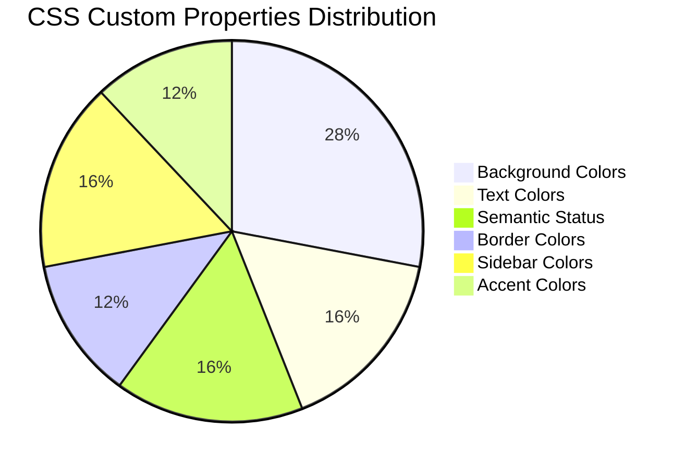

### Background Color System

| Token | Value | Usage |
|-------|-------|-------|
| `--color-bg-app` | `#eef3f8` | Page body background |
| `--color-bg-base` | `#f7f9fc` | Content area base |
| `--color-bg-surface` | `#ffffff` | Cards, panels |
| `--color-bg-elevated` | `#fdfefe` | Elevated surfaces |
| `--color-bg-muted` | `#f1f5f9` | Subdued backgrounds |
| `--color-bg-hover` | `#e8eef7` | Hover states |

### Semantic Status Colors

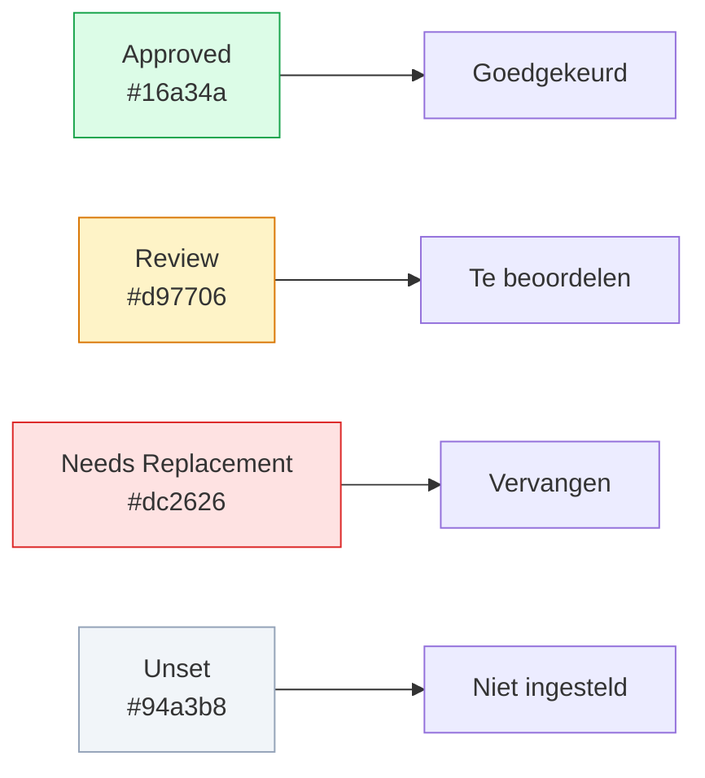

---

## Layout Grid System

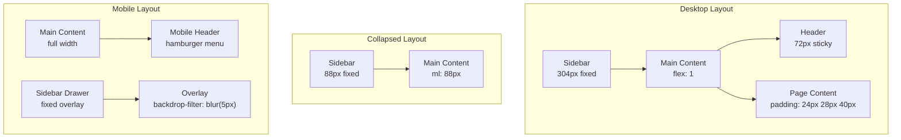

### Responsive Behavior

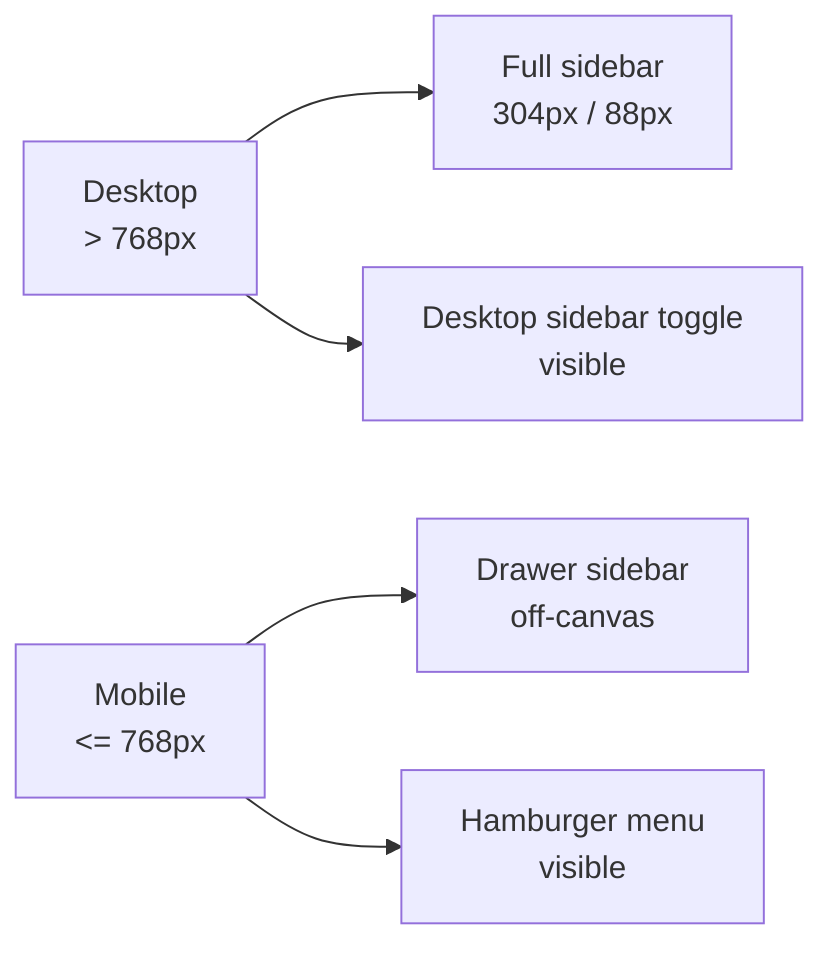

| Breakpoint | Sidebar | Header Actions |
|-----------|---------|---------------|
| Desktop (> 768px) | Fixed 304px, collapsible to 88px | Search, filters, toggles inline |
| Mobile (≤ 768px) | Off-canvas drawer with overlay | Hamburger menu only |

---

## Component Surface Design

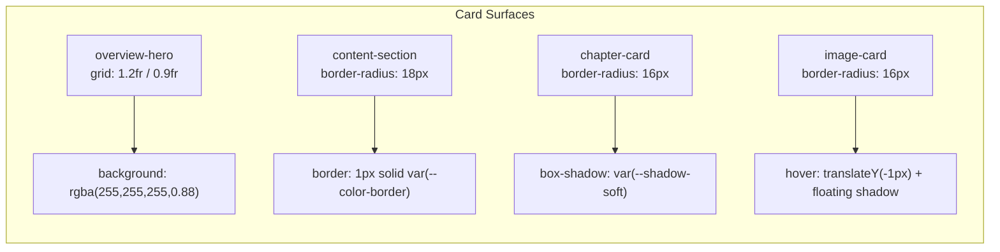

### Surface Styling Patterns

All major content surfaces share a consistent treatment:

```css
background: rgba(255, 255, 255, 0.88);
border: 1px solid var(--color-border);
border-radius: 18px;
box-shadow: var(--shadow-soft);
```

This creates a **subtle elevation** effect that separates content from the gradient page background.

---

## Glassmorphism Effects

```mermaid
graph TB
    subgraph "Header"
        H1["page-header"] --> H2["background: rgba(247,249,252,0.86)"]
        H2 --> H3["backdrop-filter: blur(12px) saturate(140%)"]
        H3 --> H4["border-bottom: 1px solid var(--color-border)"]
    end

    subgraph "Mobile Overlay"
        O1["sidebar-overlay"] --> O2["background: rgba(15,23,42,0.45)"]
        O2 --> O3["backdrop-filter: blur(5px)"]
    end

    subgraph "Sidebar"
        S1["app-sidebar"] --> S2["background: linear-gradient(...)"]
        S2 --> S3["box-shadow: 10px 0 30px rgba(15,23,42,0.04)"]
    end
```

The header uses a **strong glassmorphism** effect (`blur(12px)`) to remain legible while scrolling over content. The mobile overlay uses a softer blur to maintain context of the underlying page.

---

## Typography System

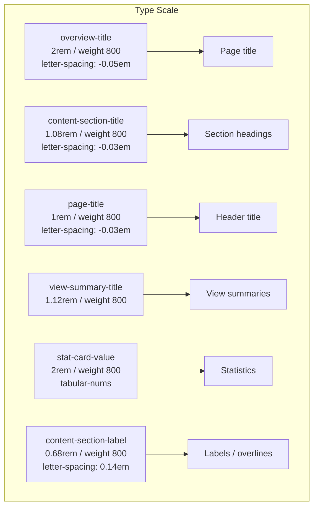

### Font Characteristics

| Property | Value | Purpose |
|----------|-------|---------|
| Family | Manrope | Modern geometric sans-serif |
| Base size | 14px | Compact, information-dense UI |
| Weights | 400, 500, 600, 700, 800 | Strong hierarchy with weight |
| Numeric | `tabular-nums` | Aligned counters in sidebar |
| Smoothing | `-webkit-font-smoothing: antialiased` | Crisp rendering on macOS |

---

## Animation & Transition System

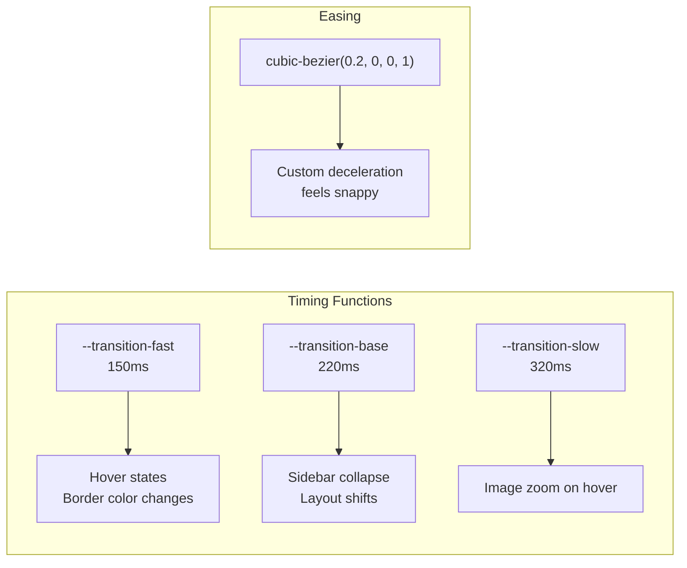

### Transition Applications

| Element | Properties | Duration |
|---------|-----------|----------|
| Sidebar | width, transform | 220ms |
| Main content | margin-left | 220ms |
| Cards | transform, border-color, box-shadow | 150ms |
| Image thumbnails | transform (scale) | 320ms |
| Sidebar items | background, border-color, color, transform | 150ms |

---

## CSS Architecture Breakdown

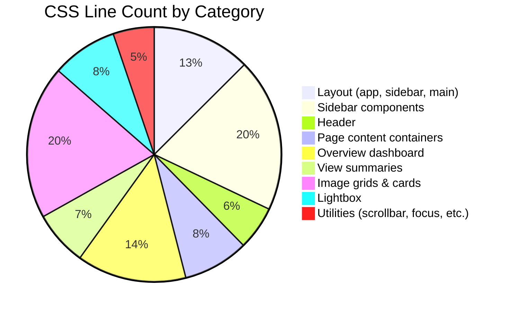

### Tailwind CSS v4 Integration

```css
@import "tailwindcss";
@import "@radix-ui/themes/styles.css";
```

Tailwind v4 is imported as a CSS module rather than configured via JavaScript. Custom CSS coexists with Tailwind's utility classes, used primarily for:
- Reset styles (`* { margin: 0; padding: 0; box-sizing: border-box; }`)
- Complex layouts requiring precise control
- Custom properties (design tokens)
- Radix UI theme customizations

### Radix UI Theme Configuration

```typescript
<Theme
  appearance="light"
  accentColor="sky"
  grayColor="slate"
  radius="small"
  scaling="100%"
>
```

| Prop | Value | Effect |
|------|-------|--------|
| `appearance` | `light` | Forces light mode (no dark mode support) |
| `accentColor` | `sky` | Blue accent for interactive elements |
| `grayColor` | `slate` | Cool gray neutrals |
| `radius` | `small` | Subtle rounding on Radix components |
| `scaling` | `100%` | Base component sizing |

---

## Focus & Accessibility Styling

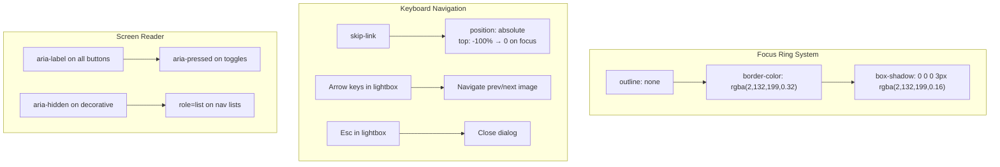

### Custom Focus Styles

```css
.sidebar-item:focus-visible,
.chapter-card:focus-visible,
.image-card:focus-visible,
.overview-image-button:focus-visible,
.lightbox-close:focus-visible,
.lightbox-nav:focus-visible {
  outline: none;
  border-color: rgba(2, 132, 199, 0.32);
  box-shadow:
    0 0 0 3px rgba(2, 132, 199, 0.16),
    0 1px 0 rgba(255, 255, 255, 0.8);
}
```

---

## Scrollbar Customization

```css
::-webkit-scrollbar {
  width: 7px;
  height: 7px;
}

::-webkit-scrollbar-track {
  background: transparent;
}

::-webkit-scrollbar-thumb {
  background: rgba(108, 122, 144, 0.45);
  border-radius: 999px;
}

::-webkit-scrollbar-thumb:hover {
  background: rgba(108, 122, 144, 0.7);
}
```

The scrollbar is intentionally **thin and subtle** (7px) with a pill-shaped thumb, matching the overall refined aesthetic.

---

## Image Grid Systems

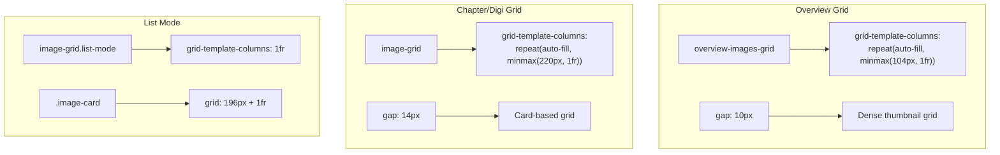

| Grid Type | Min Width | Gap | Item Type |
|-----------|-----------|-----|-----------|
| Overview thumbnails | 104px | 10px | Square image buttons |
| Chapter/Digi cards | 220px | 14px | Aspect-ratio cards |
| Chapter cards | 250px | 14px | Chapter preview cards |
| List mode | Full width | 10px | Horizontal cards |

---

## Status Indicator Visual Language

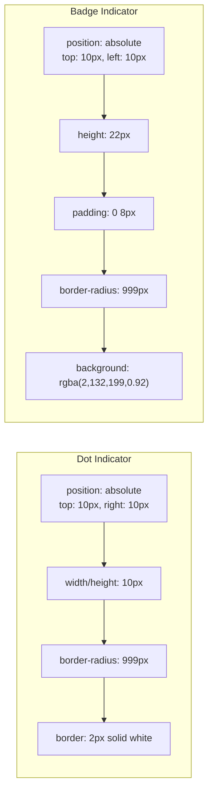

The status dot uses a **white border** to remain visible regardless of image content, with a subtle shadow for depth. The TIFF-JPG badge uses an inverted color scheme (blue background, white text) to distinguish it from status indicators.
