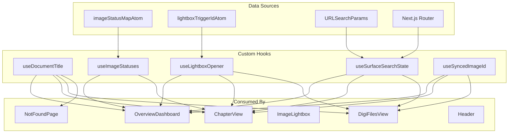
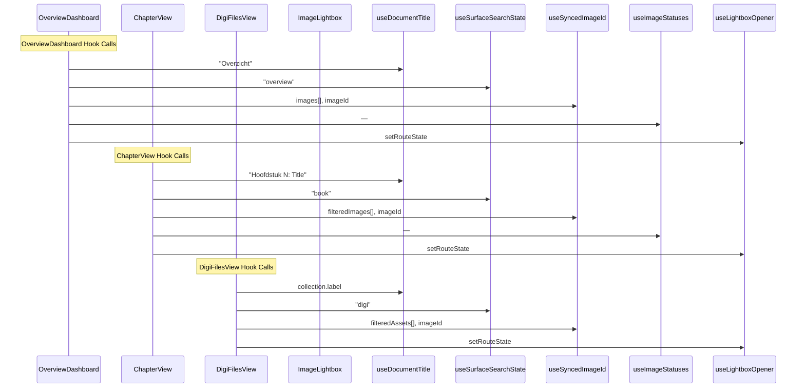
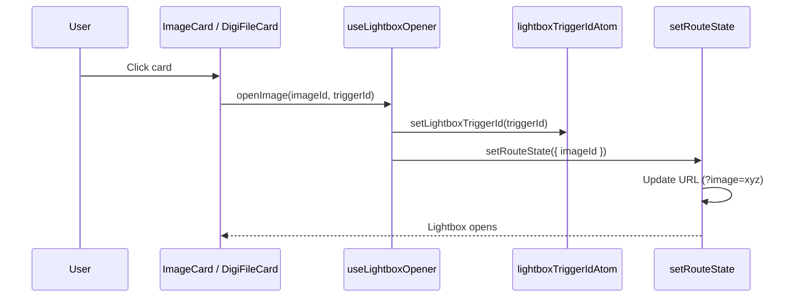
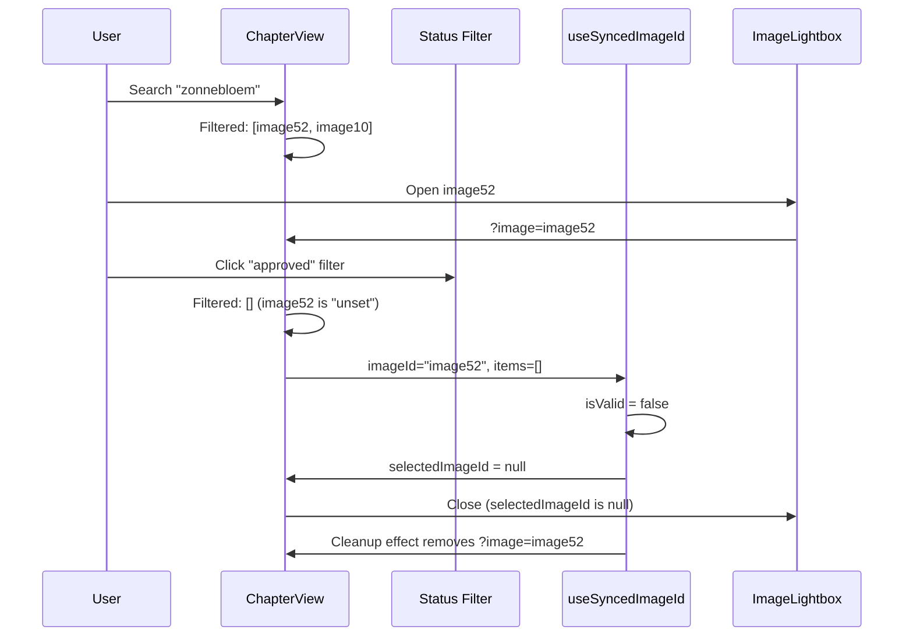

# Custom Hooks & Reusable Logic Report

## Executive Summary

The Image Asset Manager defines **5 custom hooks** that encapsulate cross-cutting concerns: document title management, status map reading, lightbox opening coordination, URL state synchronization, and image ID validation. These hooks follow React best practices with proper dependency arrays, memoization, and cleanup. They form a thin abstraction layer between Jotai atoms and React components.

---

## Hook Dependency Graph



---

## Hook Call Flow in Main Views



---

## 1. useDocumentTitle

```mermaid
graph LR
    A[useDocumentTitle(title?)] --> B{title provided?}
    B -->|Yes| C["document.title = {title} · Winston van der Bok — Beeldbeheer"]
    B -->|No| D["document.title = Winston van der Bok — Beeldbeheer"]
    C --> E[useEffect cleanup]
    D --> E
    E --> F[Reset to base title<br/>on unmount]
```

### Implementation

```typescript
const BASE_TITLE = "Winston van der Bok — Beeldbeheer";

export function useDocumentTitle(title?: string) {
  useEffect(() => {
    document.title = title ? `${title} · ${BASE_TITLE}` : BASE_TITLE;
    return () => { document.title = BASE_TITLE; };
  }, [title]);
}
```

| Aspect | Detail |
|--------|--------|
| **Dependency** | `title` parameter |
| **Side Effect** | Mutates `document.title` |
| **Cleanup** | Resets to base title on unmount |
| **Usage** | All pages + NotFoundPage |

### Title Format by Page

| Page | Title |
|------|-------|
| Overview | `Overzicht · Winston van der Bok — Beeldbeheer` |
| Chapter 1 | `Hoofdstuk 1: De Kalihna-cultuur · ...` |
| Digi Files | `Digitale bestanden · ...` or collection label |
| Not Found | `Pagina niet gevonden · ...` |

---

## 2. useImageStatuses

```mermaid
graph LR
    A[useImageStatuses()] --> B[useAtomValue(imageStatusMapAtom)]
    B --> C[Return Readonly<Record<string, ImageStatus>>]
    C --> D[Consumer calls resolveStatus(id, statusMap)]
```

### Implementation

```typescript
export function useImageStatuses(): Readonly<Record<string, ImageStatus>> {
  return useAtomValue(imageStatusMapAtom) as Readonly<Record<string, ImageStatus>>;
}
```

| Aspect | Detail |
|--------|--------|
| **Returns** | Full status map (not per-image) |
| **Pattern** | Consumers use `resolveStatus(id, statusMap)` for lookups |
| **Rationale** | Avoids creating N atoms when bulk reading is needed |
| **Re-renders** | Component re-renders when ANY status changes |

### Why Not Per-Image Atoms Here?

The hook intentionally returns the full map rather than a per-image atom because:
1. `ImageCard` needs to read statuses for display, but using per-image atoms would require dynamic atom creation in render
2. The `statusMap` object reference is stable (spread updates create new objects, but Jotai batches)
3. Bulk operations like `computeStatusCounts` need the full map

---

## 3. useLightboxOpener



### Implementation

```typescript
export function useLightboxOpener(setRouteState: (update: { imageId: string | null }) => void) {
  const setLightboxTriggerId = useSetAtom(lightboxTriggerIdAtom);

  return (imageId: string, triggerId: string) => {
    setLightboxTriggerId(triggerId);
    setRouteState({ imageId });
  };
}
```

| Aspect | Detail |
|--------|--------|
| **Parameters** | `setRouteState` callback (from `useSurfaceSearchState`) |
| **Returns** | `(imageId: string, triggerId: string) => void` |
| **Side Effects** | Sets trigger ID atom + updates route state |
| **Purpose** | Captures which DOM element opened the lightbox for focus restoration |

### Focus Restoration Chain

```mermaid
graph LR
    A[User clicks card<br/>#chapter-image-xyz] --> B[setLightboxTriggerId("chapter-image-xyz")]
    B --> C[Lightbox opens]
    C --> D[User closes lightbox]
    D --> E[Dialog onCloseAutoFocus]
    E --> F[document.getElementById("chapter-image-xyz")]
    F --> G[triggerElement.focus()]
```

---

## 4. useSurfaceSearchState

```mermaid
graph TB
    subgraph "Read Phase"
        R1[useSearchParams] --> R2[readLooseRouteSearchState]
        R2 --> R3["q: string"]
        R2 --> R4["status: ImageStatus | null"]
        R2 --> R5["view: RouteViewMode"]
        R2 --> R6["imageId: string | null"]
    end

    subgraph "Canonicalization Effect"
        C1[createSurfaceSearchParams(surface, state)] --> C2[Compare with currentSearch]
        C2 --> C3{Mismatch?}
        C3 -->|Yes| C4[router.replace(canonicalURL)]
        C3 -->|No| C5[Do nothing]
    end

    subgraph "Write Phase"
        W1[setRouteState(updates, options?)] --> W2[Merge with current state]
        W2 --> W3[createSurfaceSearchParams]
        W3 --> W4{options.replace?}
        W4 -->|Yes| W5[router.replace]
        W4 -->|No| W6[router.push]
    end
```

### Implementation Deep Dive

```typescript
export function useSurfaceSearchState(surface: RouteSurface) {
  const searchParams = useSearchParams();
  const router = useRouter();
  const pathname = usePathname();
  const state = useMemo(() => readLooseRouteSearchState(searchParams), [searchParams]);
  const currentSearch = searchParams.toString();
  const canonicalSearchParams = useMemo(
    () => createSurfaceSearchParams(surface, state),
    [surface, state],
  );
  const canonicalSearch = canonicalSearchParams.toString();

  // Canonicalization effect
  useEffect(() => {
    if (currentSearch !== canonicalSearch) {
      const search = canonicalSearchParams.toString();
      router.replace(`${pathname}${search ? `?${search}` : ""}`);
    }
  }, [canonicalSearch, canonicalSearchParams, currentSearch, pathname, router]);

  // Setter
  const setRouteState = useCallback(
    (updates: Partial<RouteSearchState>, options?: SetRouteStateOptions) => {
      const nextSearchParams = createSurfaceSearchParams(surface, { ...state, ...updates });
      const search = nextSearchParams.toString();
      const url = `${pathname}${search ? `?${search}` : ""}`;
      if (options?.replace) {
        router.replace(url);
      } else {
        router.push(url);
      }
    },
    [pathname, router, state, surface],
  );

  return { ...state, setRouteState };
}
```

| Aspect | Detail |
|--------|--------|
| **Dependencies** | `useSearchParams`, `useRouter`, `usePathname` |
| **Memoization** | `state` and `canonicalSearchParams` memoized to prevent loops |
| **Effect** | Canonicalization runs when URL doesn't match expected form |
| **Setter** | `useCallback` with stable dependencies |

### Why `replace` for Canonicalization?

The canonicalization uses `router.replace()` (not `push()`) because:
1. It corrects invalid/malformed URLs without adding history entries
2. Users don't need a back button to return to the invalid URL
3. It's a silent cleanup, not a user action

---

## 5. useSyncedImageId

```mermaid
graph TB
    subgraph "Validation"
        A[items: readonly {id}[]] --> B{imageId in items?}
        B -->|Yes| C[selectedImageId = imageId]
        B -->|No| D[selectedImageId = null]
    end

    subgraph "Cleanup Effect"
        D --> E{imageId exists but selectedImageId is null?}
        E -->|Yes| F[setRouteState({ imageId: null }, { replace: true })]
        E -->|No| G[No action needed]
    end

    C --> H[Return selectedImageId]
    F --> H
    G --> H
```

### Use Case: Filter Change + Stale Image ID



This prevents the confusing UX of a lightbox showing an image that doesn't match current filters.

---

## Hook Composition Patterns

```mermaid
graph TB
    subgraph "Pattern: Atom + Hook"
        A1[atom declaration<br/>atoms.ts] --> A2[hook wrapper<br/>useImageStatuses.ts]
        A2 --> A3[component usage]
    end

    subgraph "Pattern: Factory + Memo"
        B1[factory function<br/>imageStatusAtom(id)] --> B2[useMemo in component]
        B2 --> B3[useAtom with memoized atom]
    end

    subgraph "Pattern: Callback Factory"
        C1[hook returns function<br/>useLightboxOpener] --> C2[component calls returned fn]
        C2 --> C3[fn closes over atom setter]
    end

    subgraph "Pattern: Sync + Validate"
        D1[useSyncedImageId] --> D2[validates against item list]
        D2 --> D3[cleans up URL if invalid]
    end
```

---

## Hook Testing Characteristics

| Hook | Pure? | Side Effects | Mock Requirements |
|------|-------|-------------|-------------------|
| `useDocumentTitle` | No | `document.title` mutation | JSDOM `document` |
| `useImageStatuses` | Yes | None | Jotai Provider wrapper |
| `useLightboxOpener` | Yes | Atom write | Jotai Provider wrapper |
| `useSurfaceSearchState` | No | URL manipulation, router calls | Next.js router mock |
| `useSyncedImageId` | No | `useEffect` + route state update | Next.js router mock |

All hooks are **client-only** (marked `"use client"`) and depend on browser APIs or Next.js client-side navigation.
