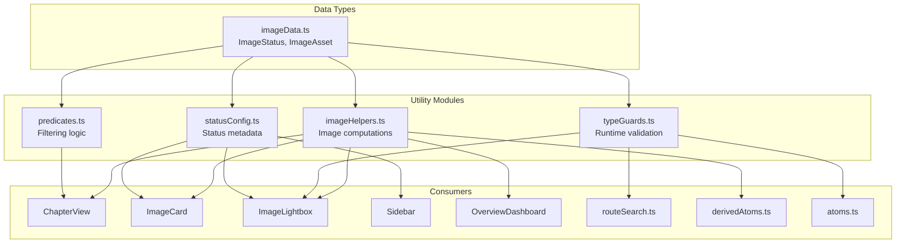
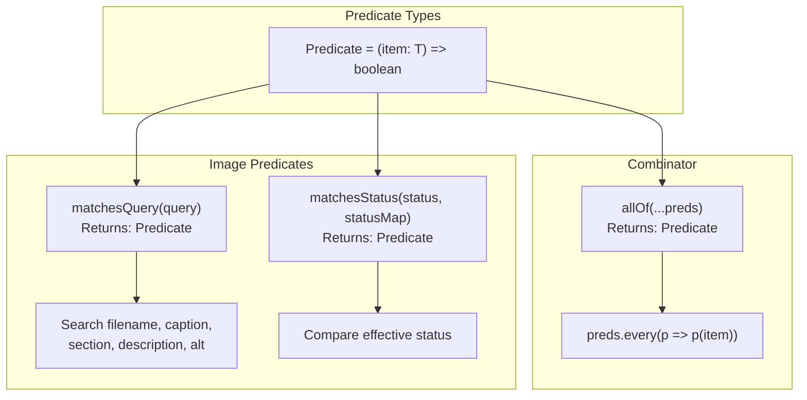
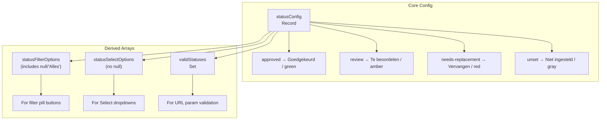
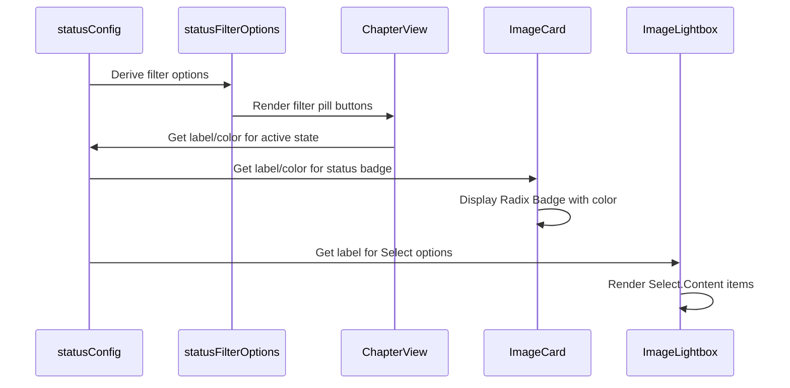
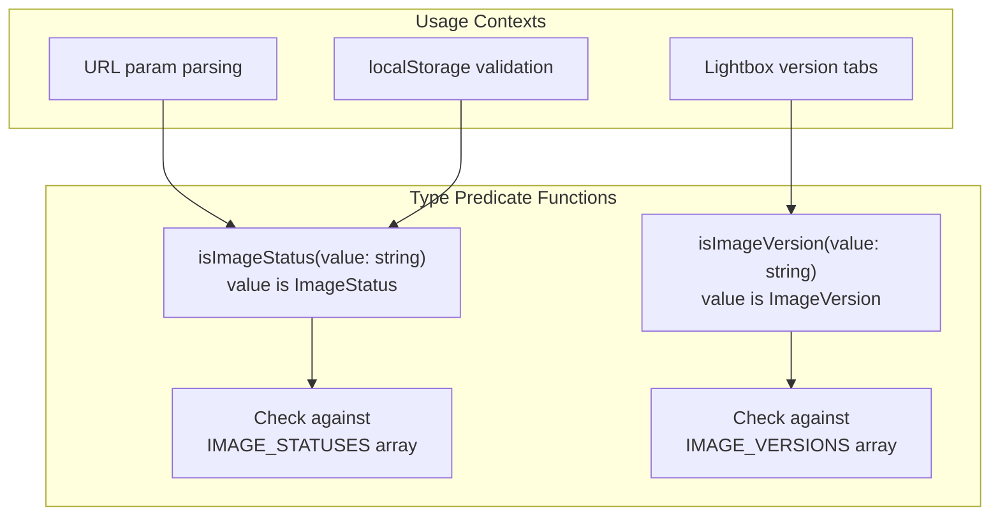
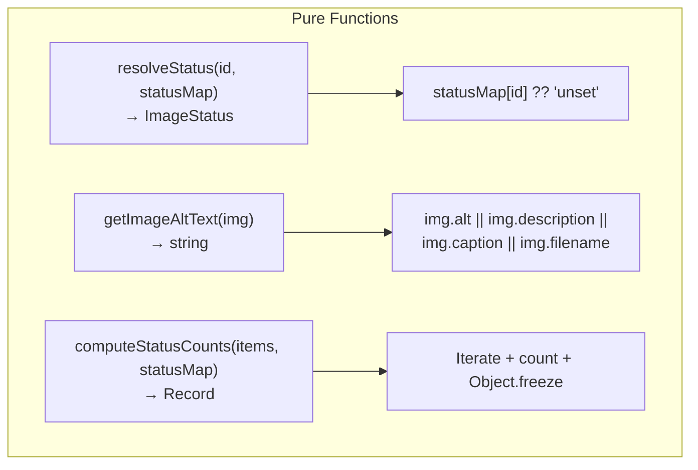
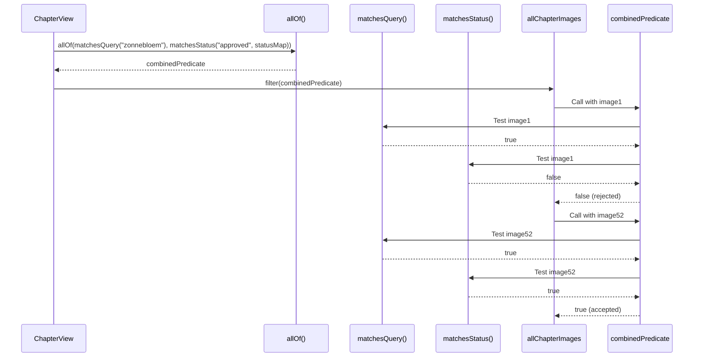
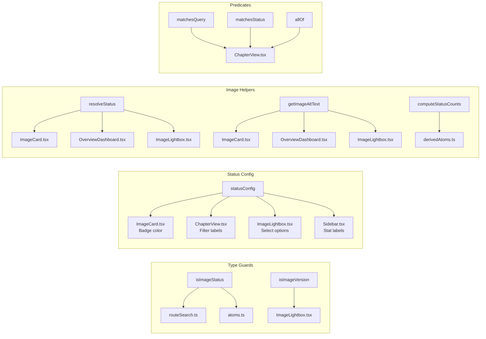
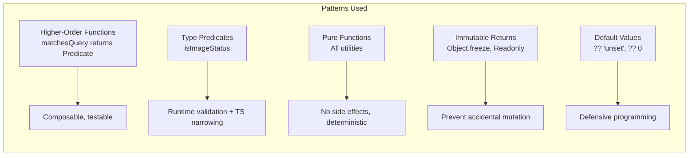

# Utilities & Helper Functions Report

## Executive Summary

The Image Asset Manager maintains a clean utility layer with **4 focused modules** totaling ~170 lines of code. These utilities provide type-safe predicates for filtering, single-source-of-truth configuration for status metadata, runtime type guards for URL validation, and pure helper functions for image-related computations. The design emphasizes functional programming patterns, immutability, and type safety.

---

## Utility Module Dependency Graph



---

## Module Breakdown

### 1. predicates.ts — Functional Filtering



#### `allOf` Combinator

```typescript
export const allOf = <T>(...preds: Predicate<T>[]): Predicate<T> =>
  (item) => preds.every((p) => p(item));
```

The `allOf` combinator enables **composable filtering**:

```typescript
// In ChapterView
allChapterImages.filter(
  allOf(matchesQuery(deferredSearchQuery), matchesStatus(status, statusMap))
);
```

Both predicates must pass for an image to be included. This pattern is extensible — additional predicates can be added without modifying existing ones.

#### `matchesQuery`

| Aspect | Detail |
|--------|--------|
| **Fields searched** | `filename`, `caption`, `section`, `description`, `alt` |
| **Case handling** | Lowercase comparison |
| **Empty query** | Pass-through (returns `true`) |
| **Trimming** | Query is trimmed before comparison |

```typescript
export const matchesQuery = (query: string): Predicate<ImageAsset> => (img) => {
  if (!query) return true;
  const q = query.trim().toLowerCase();
  if (!q) return true;
  return (
    img.filename.toLowerCase().includes(q) ||
    img.caption.toLowerCase().includes(q) ||
    img.section.toLowerCase().includes(q) ||
    (img.description?.toLowerCase().includes(q) ?? false) ||
    (img.alt?.toLowerCase().includes(q) ?? false)
  );
};
```

The `?? false` fallback handles potentially undefined `description` and `alt` fields gracefully.

#### `matchesStatus`

```typescript
export const matchesStatus = (
  status: ImageStatus | null,
  statusMap: Readonly<Record<string, ImageStatus>>,
): Predicate<ImageAsset> => (img) => {
  if (!status) return true;
  const effective = statusMap[img.id] ?? "unset";
  return effective === status;
};
```

| Aspect | Detail |
|--------|--------|
| **Null status** | Pass-through (show all) |
| **Effective status** | Looks up `statusMap[img.id]`, defaults to `"unset"` |
| **Comparison** | Strict equality (`===`) |

---

### 2. statusConfig.ts — Single Source of Truth



#### `satisfies` Pattern

```typescript
export const statusConfig = {
  approved: { label: "Goedgekeurd", color: "green" as const },
  review: { label: "Te beoordelen", color: "amber" as const },
  "needs-replacement": { label: "Vervangen", color: "red" as const },
  unset: { label: "Niet ingesteld", color: "gray" as const },
} as const satisfies Record<ImageStatus, { label: string; color: string }>;
```

The `satisfies` operator ensures:
1. All `ImageStatus` keys are present (completeness check)
2. Values have the correct shape (`{ label: string; color: string }`)
3. Literal types are preserved (`"green"` not `string`)

#### Usage Chain



---

### 3. typeGuards.ts — Runtime Validation



#### Implementation

```typescript
const IMAGE_STATUSES: readonly string[] = ["approved", "review", "needs-replacement", "unset"];
const IMAGE_VERSIONS: readonly string[] = ["regular", "optimized", "print"];

export function isImageStatus(value: string): value is ImageStatus {
  return (IMAGE_STATUSES as readonly string[]).includes(value);
}

export function isImageVersion(value: string): value is ImageVersion {
  return (IMAGE_VERSIONS as readonly string[]).includes(value);
}
```

#### Type Predicate Benefits

```typescript
// Without type predicate
const rawStatus = searchParams.get("status");
if (rawStatus === "approved" || rawStatus === "review" || ...) {
  // Type is still string | null
}

// With type predicate
if (rawStatus && isImageStatus(rawStatus)) {
  // Type is narrowed to ImageStatus
  const status: ImageStatus = rawStatus;
}
```

Type predicates enable TypeScript's **control flow narrowing**, eliminating the need for manual type assertions.

#### Consumption Points

| Function | Used By | Purpose |
|----------|---------|---------|
| `isImageStatus` | `routeSearch.ts` | Validate URL `?status=` param |
| `isImageStatus` | `atoms.ts` | Validate corrupted localStorage data |
| `isImageStatus` | `ImageLightbox.tsx` | Validate Select dropdown value |
| `isImageVersion` | `ImageLightbox.tsx` | Validate version tab value |

---

### 4. imageHelpers.ts — Image Computations



#### `resolveStatus`

```typescript
export const resolveStatus = (
  id: string,
  statusMap: Readonly<Record<string, ImageStatus>>,
): ImageStatus => statusMap[id] ?? "unset";
```

The canonical function for resolving an image's effective status. Used in virtually every component that displays status information.

#### `getImageAltText`

```typescript
export const getImageAltText = (img: ImageAsset): string =>
  img.alt || img.description || img.caption || img.filename;
```

Provides **graceful degradation** for alt text:
1. `alt` — Most specific accessibility text
2. `description` — Detailed description
3. `caption` — Short caption
4. `filename` — Guaranteed fallback

#### `computeStatusCounts`

```typescript
export const computeStatusCounts = (
  items: readonly { readonly id: string }[],
  statusMap: Readonly<Record<string, ImageStatus>>,
): Readonly<Record<ImageStatus, number>> => {
  const counts: Record<ImageStatus, number> = {
    approved: 0, review: 0, "needs-replacement": 0, unset: 0
  };
  for (const item of items) {
    const s = resolveStatus(item.id, statusMap);
    counts[s] = (counts[s] ?? 0) + 1;
  }
  return Object.freeze(counts);
};
```

| Aspect | Detail |
|--------|--------|
| **Input abstraction** | Accepts `readonly { readonly id: string }[]`, not `ImageAsset[]` |
| **Completeness** | Initializes all 4 status counters to 0 |
| **Safety** | `(counts[s] ?? 0) + 1` handles unexpected status values |
| **Immutability** | Returns `Object.freeze(counts)` |
| **Time complexity** | O(n) single pass |

---

## Predicate Composition Flow



---

## Cross-Module Data Flow



---

## Functional Programming Patterns



---

## Testability Assessment

| Module | Pure Functions | Side Effects | Mocking Needed | Test Priority |
|--------|---------------|-------------|----------------|---------------|
| `predicates.ts` | ✅ All | None | None | High |
| `statusConfig.ts` | ✅ All | None | None | Medium |
| `typeGuards.ts` | ✅ All | None | None | High |
| `imageHelpers.ts` | ✅ All | None | None | High |

All utility modules are **100% pure** and require zero mocking, making them ideal candidates for unit testing.

### Example Test Cases

```typescript
// predicates.ts
describe("matchesQuery", () => {
  const img = { filename: "test.jpg", caption: "Sunflower", section: "Art", description: "", alt: "" };

  it("matches filename", () => {
    expect(matchesQuery("test")(img)).toBe(true);
  });

  it("is case-insensitive", () => {
    expect(matchesQuery("SUNFLOWER")(img)).toBe(true);
  });

  it("returns true for empty query", () => {
    expect(matchesQuery("")(img)).toBe(true);
  });
});

// imageHelpers.ts
describe("computeStatusCounts", () => {
  it("counts all statuses correctly", () => {
    const items = [{ id: "a" }, { id: "b" }, { id: "c" }];
    const statusMap = { a: "approved", b: "review" };
    const counts = computeStatusCounts(items, statusMap);
    expect(counts).toEqual({ approved: 1, review: 1, "needs-replacement": 0, unset: 1 });
  });
});
```
